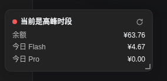

# dsh-usage-card · DeepSeek 用量状态卡片

> 在 DeepSeek Harness（DSH）Web GUI 左下角常驻一张状态卡片：**实时余额 · 高峰/空闲时段 · 今日 Flash/Pro 花费**。纯 Host 插件，免 client 构建、免动态插件审批、重启自动生效。



## 特性

| 能力 | 说明 |
| --- | --- |
| 💰 **实时余额** | 每次刷新直接请求 `api.deepseek.com/user/balance`（官网真实数据），可手动点刷新按钮立即更新 |
| 🌗 **高峰/空闲时段** | 按 DeepSeek 官方峰谷定价规则（北京时间 9:00–12:00、14:00–18:00 为高峰）实时判断；高峰显示**红色**圆点，空闲显示**绿色**圆点 |
| 📊 **今日 Flash / Pro 花费** | 从会话日志的模型真实上报 token 用量，按官方峰谷单价换算金额，自动归类 Flash / Pro |
| ⚡ **缓存未命中动画** | 请求进行中发生缓存未命中时，在今日花费行弹出 `未命中 +¥xx.xx` 浮动动画提示（仅新发生的未命中触发，刷新/切页不会重放历史） |
| 🖱️ **可拖动 / 可调整大小** | 按住标题栏拖动位置，拖右下角手柄调整大小，位置与尺寸自动记忆（localStorage） |
| 🔒 **无隐私泄漏** | 不硬编码任何 API Key；API Key 通过 DSH `credentials` 服务动态读取，代码中只有变量名 |
| ♻️ **重启自动生效** | 作为正式 bundle 装配进 web profile，重启 DSH 后自动出现，无需动态插件审批 |

## 原理

这是一个**纯 Host 插件**，刻意绕开了 client 端构建链：

```
dsh-usage-card (bundle)
├── lib/index.js   Host 端：
│                  ├─ 注册 GET /usage-status.json 路由
│                  │    ├─ 余额：curl api.deepseek.com/user/balance（用 credentials 服务的 DEEPSEEK_API_KEY）
│                  │    ├─ 高峰判断：北京时间 9-12 / 14-18
│                  │    └─ 今日花费：遍历内存 + 磁盘全部会话的 usage 事件，
│                  │       按请求发起时刻的峰谷单价计价，指纹去重防止重复会话副本重复计费
│                  └─ webServer.tapIndex 向 index.html 注入 lib/card.js
└── lib/card.js    自包含前端脚本（纯 DOM + fetch，无需 client 模块系统/构建）
```

**为什么不用动态插件（cordis_define）？** 动态插件只存在于当前进程内存，重启即消失，且需要审批；正式 bundle 落盘装配，重启自动生效。

**为什么不用 client 构建？** DSH 的 client 插件需要 `window.__ModuleLoader__` 构建产物（Vite/rollup）；本插件用 `tapIndex` 注入一段自包含脚本，完全绕开构建工具链，`lib/card.js` 就是最终产物。

## 安装

### 系统要求

- 已安装 DeepSeek Harness，`dsh web` 可正常启动
- `~/.dsh/.credentials.yaml` 中已有 `DEEPSEEK_API_KEY`（余额查询用）

### 方式 A：作为 profile bundle（推荐，重启自动生效）

```bash
# 1. 把插件放到 profile 目录（或任意位置）
mkdir -p ~/.dsh/profiles/web/dsh-usage-card
cp -r dsh-usage-card/* ~/.dsh/profiles/web/dsh-usage-card/

# 2. 在 profile 的 cordis.patch.yml 中加入插件行
cat >> ~/.dsh/profiles/web/cordis.patch.yml << 'EOF'
- insert:
    - id: usage-card
      name: './dsh-usage-card/lib/index.js'
EOF

# 3. 重启 DSH
systemctl --user restart dsh.service   # 或你平时的启动方式
```

> 用相对路径 `./dsh-usage-card/lib/index.js` 直接引用 profile 目录下的文件：**改代码后只需重启**，无 pnpm 快照、无构建步骤。注意 DSH loader 的 `import()` 只支持具体文件路径（不支持目录导入），所以指向 `lib/index.js` 而不是目录。

### 方式 B：作为独立 bundle（pnpm 装配）

```bash
cd ~/.dsh/profiles/web
pnpm add file:/path/to/dsh-usage-card
# 手动把 @tssh/dsh-usage-card 加入 package.json 的 dsh.profile.bundles
# 重启 dsh web
```

> ⚠️ pnpm 的 `file:` 依赖是**快照**：修改源目录后必须 `pnpm remove && pnpm add` 刷新副本，否则 node_modules 里是旧代码。方式 A 无此问题。

## 配置

无配置文件。所有行为由代码常量控制：

| 项 | 位置 | 默认值 |
| --- | --- | --- |
| 高峰时段 | `lib/index.js` `isPeakAt` | 北京 9:00–12:00、14:00–18:00 |
| 单价 | `lib/index.js` `PRICES` | Flash：输入 3.0/1.5、命中 0.1/0.05、输出 9.0/4.5（元/百万 token）；Pro 对应更高 |
| 刷新间隔 | `lib/card.js` `setInterval(load, 10000)` | 10 秒 |
| 卡片位置/大小 | `localStorage['dsu-card-geometry']` | 默认左下角 252×auto，拖动/缩放后记忆 |

## 开发

```bash
# 本地修改后
node --check lib/index.js && node --check lib/card.js   # 语法检查
cp lib/index.js lib/card.js ~/.dsh/profiles/web/dsh-usage-card/lib/  # 方式 A 同步
systemctl --user restart dsh.service
```

## 常见问题

**Q: 余额与官网一致吗？**
A: 一致。余额直接调用官方 `/user/balance` 接口，每次刷新都是真实数据。

**Q: 今日花费与官网对不上？**
A: 官网没有 API Key 可访问的消费查询接口（用量/成本是浏览器登录会话的私有 dashboard 端点，`platform.deepseek.com/api/v0/usage/*` 需 userToken）。今日花费是**本地估算**：token 数是模型真实上报的，金额按官方公开峰谷单价换算。已做以下修正以贴近官网：按请求发起时刻计费、指纹去重（防止 fork/恢复产生的重复会话副本重复计费）、读取磁盘全部持久化会话（不只内存）。误差通常 < ¥0.02，但极端情况下（价格调整、缓存计费差异）可能与官网有出入。

**Q: 会遮挡其他插件的按钮吗？**
A: 卡片固定定位在左下角。装了大量侧边栏入口插件（如 dsh-web-ui 全家桶）时可能遮挡——卡片**可拖动**（按住标题栏）和**可调整大小**（右下角手柄），位置尺寸自动记忆，挪开即可。

**Q: 卡片会拦截点击吗？**
A: 卡片本体 `user-select: none` 且不拦截点击；只有刷新按钮、标题栏（拖动）、右下角手柄（调整大小）是可交互的。

**Q: 窄栏（56px）模式下显示吗？**
A: 显示。卡片是独立 fixed 定位，不依赖侧边栏槽位，与 cordis-panel/设置按钮无叠加问题（此前的动态插件版本因占 `sidebar.footer.action` 槽位与 shipped 按钮冲突，正式版已改为注入脚本方案彻底规避）。

## 与 dsh-web-ui 全家桶的兼容性

[dsh-web-ui](https://github.com/zhu1090093659/dsh-web-ui) 的 15 个插件（任务看板、Git 图谱、SSH、宠物、皮肤等）均为新增功能、使用独立 `web-ui-*` 行 ID、不占用 `sidebar.footer.action` 槽位、不调用 `tapIndex`、不注册 `/usage-status.json` 路由——与本插件**零冲突**，可同时安装。

## License

MIT
